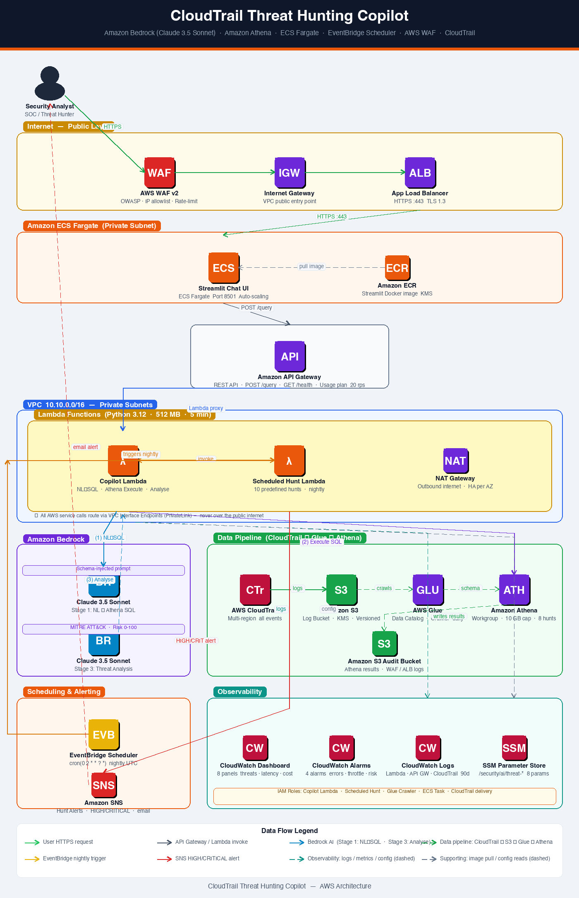

# CloudTrail Threat Hunting Copilot

An AI-powered security operations tool that lets SOC engineers and threat hunters query AWS CloudTrail logs using **plain English**. The copilot converts natural-language questions into Athena SQL, executes them against your CloudTrail data lake, and returns structured threat intelligence mapped to the **MITRE ATT&CK** framework — all backed by **Amazon Bedrock (Claude 3.5 Haiku via cross-region inference profile)**.



---

## Table of Contents

- [Overview](#overview)
- [Architecture](#architecture)
- [AWS Services Used](#aws-services-used)
- [Project Structure](#project-structure)
- [Prerequisites](#prerequisites)
- [Configuration](#configuration)
- [Deployment](#deployment)
- [Post-Deployment Steps](#post-deployment-steps)
- [Using the Copilot](#using-the-copilot)
- [Scheduled Threat Hunts](#scheduled-threat-hunts)
- [Security Controls](#security-controls)
- [Observability](#observability)
- [Cost Considerations](#cost-considerations)
- [Troubleshooting](#troubleshooting)
- [Cleanup](#cleanup)

---

## Overview

The copilot operates as a **3-stage AI pipeline**:

| Stage | What happens |
|-------|-------------|
| **Stage 1** | User types a question in English → Bedrock (Claude 3.5 Haiku) converts it to a valid Athena SQL query, injected with the full 24-column CloudTrail schema |
| **Stage 2** | The generated SQL is executed against your CloudTrail logs via Amazon Athena (10 GB per-query cap, results written to S3) |
| **Stage 3** | Athena results are fed back to Bedrock for threat analysis: MITRE ATT&CK mapping, risk scoring (0–100), suspicious pattern detection, and recommended actions |

The chat interface runs as a **Streamlit** application on **ECS Fargate**, protected by AWS WAF v2 and an Application Load Balancer with TLS 1.3. All AWS API traffic routes through **VPC Interface Endpoints (PrivateLink)** — Bedrock, Athena, S3, SNS, and CloudWatch Logs calls never traverse the public internet.

---

## Architecture

```
Security Analyst (Browser)
        │  HTTPS
        ▼
  ┌─────────────────────────────────────────┐
  │         Public Layer                    │
  │  AWS WAF v2 → Internet GW → App LB     │
  └────────────────────┬────────────────────┘
                       │  HTTPS :443
  ┌─────────────────── ▼ ───────────────────┐
  │  Amazon ECS Fargate (Private Subnet)    │
  │  Streamlit Chat UI  ←── Amazon ECR      │
  └────────────────────┬────────────────────┘
                       │  POST /query
                       ▼
            Amazon API Gateway REST
                       │  Lambda proxy
  ┌──────────────────── ▼ ──────────────────────────┐
  │   VPC 10.10.0.0/16  —  Private Subnets          │
  │  ┌──────────────────────────────────────────┐   │
  │  │     Lambda Functions (Python 3.12)       │   │
  │  │  Copilot Lambda  ← Scheduled Hunt Lambda │   │
  │  └──────────────────────────────────────────┘   │
  │  🔐 All AWS calls via PrivateLink endpoints      │
  └───────────────────────────────────────────────── ┘
          │                        │
          ▼                        ▼
  ┌──────────────┐    ┌────────────────────────────┐
  │ Amazon       │    │ Data Pipeline              │
  │ Bedrock      │    │ CloudTrail → S3 → Glue     │
  │ Claude (×2)  │    │           → Athena         │
  └──────────────┘    └────────────────────────────┘
  ┌──────────────┐    ┌────────────────────────────┐
  │ Scheduling   │    │ Observability              │
  │ EventBridge  │    │ CloudWatch Dashboard       │
  │ Amazon SNS   │    │ Alarms · Logs · SSM        │
  └──────────────┘    └────────────────────────────┘
```

---

## AWS Services Used

| Service | Purpose |
|---------|---------|
| **Amazon Bedrock** (Claude 3.5 Haiku) | Stage 1 NL→SQL generation · Stage 3 threat analysis & MITRE ATT&CK mapping — uses cross-region inference profile (`us.` prefix) for on-demand throughput |
| **Amazon Athena** | Serverless SQL execution against CloudTrail logs · 10 GB per-query cost cap · 8 pre-built named hunt queries |
| **AWS CloudTrail** | Multi-region trail capturing all management events and S3 data events |
| **Amazon S3** | CloudTrail log storage (KMS-SSE, versioned, lifecycle to Glacier) · Athena results & AI analyses |
| **AWS Glue** | Data Catalog with full 24-column CloudTrail schema · daily crawler for partition auto-discovery |
| **AWS Lambda** (Python 3.12) | Copilot orchestrator (NL→SQL→Execute→Analyse) · Scheduled Hunt runner |
| **Amazon API Gateway** | REST API (`POST /query`, `GET /health`) · usage plan 1 000 req/day · 20 rps throttle · X-Ray |
| **Amazon ECS Fargate** | Streamlit chat UI in private subnets · CPU auto-scaling (max 4 tasks) |
| **Amazon ECR** | Container registry for Streamlit image · KMS-encrypted · scan-on-push |
| **Application Load Balancer** | HTTPS :443 TLS 1.3 · ACM certificate · WAF attached |
| **AWS WAF v2** | OWASP Core Rule Set · IP allowlist · rate limiting (100 req/5 min) · SQLi protection |
| **EventBridge Scheduler** | Nightly `cron(0 2 * * ? *)` automated threat hunt |
| **Amazon SNS** | HIGH/CRITICAL threat alerts → email notification |
| **CloudWatch** | Dashboard (8 widgets) · 4 alarms · log groups for Lambda, API GW, CloudTrail · metric filters |
| **SSM Parameter Store** | 8 SecureString parameters under `/security/ai/threat-hunting/*` |
| **VPC Interface Endpoints** | PrivateLink for Bedrock, Athena, S3, SNS, CloudWatch Logs, ECR |
| **AWS KMS** | Encryption for S3, SNS, Lambda environment variables |
| **AWS IAM** | Least-privilege roles for Lambda, Glue Crawler, ECS Task, CloudTrail delivery |

---

## Project Structure

```
Cloudtrail-threat-hunting-copilot/
│
├── main.tf                  # Provider config (aws ~> 5.0, archive ~> 2.4)
├── variables.tf             # All input variables with defaults
├── locals.tf                # Computed locals (name prefix, common tags)
├── outputs.tf               # Key outputs (URLs, ARNs, next-step commands)
│
├── networking.tf            # VPC, subnets, IGW, NAT GW, route tables, VPC endpoints
├── security_groups.tf       # SGs for Lambda, ALB, ECS, VPC endpoints
├── iam.tf                   # 6 IAM roles (Copilot Lambda, Scheduled Hunt, Glue, ECS, CloudTrail)
│
├── s3.tf                    # CloudTrail logs bucket + Audit results bucket
├── cloudtrail.tf            # Multi-region trail + optional CloudTrail Lake
├── glue.tf                  # Glue database, 24-col CloudTrail table, daily crawler
├── athena.tf                # Workgroup + 8 named threat hunt queries
│
├── lambda.tf                # Copilot + Scheduled Hunt Lambda functions, SNS topic
├── api_gateway.tf           # REST API, request validator, CORS, usage plan, X-Ray
│
├── ecr.tf                   # ECR repository (KMS, scan-on-push, lifecycle policy)
├── alb.tf                   # ALB, target group, HTTPS listener, ACM cert
├── ecs.tf                   # ECS cluster, task definition, service, auto-scaling
│
├── waf.tf                   # WAF v2 WebACL (OWASP, IP allowlist, rate limit, SQLi)
├── eventbridge.tf           # Nightly hunt scheduler (enable/disable toggle)
├── cloudwatch.tf            # Dashboard, 4 alarms, log groups, metric filters
├── ssm.tf                   # 8 SSM parameters
│
├── lambda/
│   ├── copilot/
│   │   └── handler.py       # 3-stage AI pipeline (NL→SQL → Athena → Analyse)
│   └── scheduled_hunt/
│       └── handler.py       # 10 predefined nightly hunt queries + SNS alerting
│
├── streamlit/
│   ├── app.py               # Streamlit chat UI with MITRE ATT&CK display
│   ├── Dockerfile           # python:3.12-slim, health check, headless Streamlit
│   ├── requirements.txt     # streamlit==1.40.2, requests==2.32.3
│   └── config.toml          # Dark theme, CSRF protection, no CORS
│
└── architecture_1.png       # AWS architecture diagram
```

---

## Prerequisites

| Requirement | Version / Notes |
|-------------|-----------------|
| Terraform | `>= 1.5.0` |
| AWS CLI | `>= 2.x`, configured with credentials |
| Docker | Required to build and push the Streamlit image |
| Python | `3.12` (for local Lambda testing) |
| AWS account | Bedrock **Claude 3.5 Haiku** must be enabled and use-case form submitted in your region |
| Domain name | Required for the ALB ACM certificate (`streamlit_domain` variable) |

> **Bedrock model access**: Before deploying, navigate to **AWS Console → Amazon Bedrock → Model access** and enable `Claude 3.5 Haiku (claude-3-5-haiku-20241022-v1:0)` in your target region.
>
> The deployed model uses the **cross-region inference profile** ID `us.anthropic.claude-3-5-haiku-20241022-v1:0` (note the `us.` prefix). This is required for on-demand throughput — bare model IDs without the prefix will fail with `ValidationException: on-demand throughput isn't supported`.
>
> Some models (including Haiku) require submitting an **Anthropic use-case form** before they can be invoked. If you see `AccessDeniedException: use case details have not been submitted`, complete the form at **Bedrock → Model access → Manage model access → Anthropic → Submit use case details**.
>
> The IAM policy allows `arn:aws:bedrock:*::foundation-model/anthropic.claude-*` (wildcard region) because cross-region inference profiles route requests across multiple AWS regions internally.

---

## Configuration

All configuration is controlled through `variables.tf`. Create a `terraform.tfvars` file:

```hcl
# terraform.tfvars

aws_region   = "us-east-1"
project_name = "ct-hunt-copilot"
environment  = "prod"

# Networking
vpc_cidr             = "10.10.0.0/16"
public_subnet_cidrs  = ["10.10.0.0/24", "10.10.1.0/24"]
private_subnet_cidrs = ["10.10.10.0/24", "10.10.11.0/24"]
availability_zones   = ["us-east-1a", "us-east-1b"]

# Bedrock — cross-region inference profile (us. prefix required)
bedrock_model_id = "us.anthropic.claude-3-5-haiku-20241022-v1:0"

# Streamlit UI
streamlit_domain = "copilot.yourdomain.com"   # your custom domain

# WAF — restrict to your office/VPN IP ranges in production
allowed_ip_ranges = ["203.0.113.0/24"]

# Notifications — leave blank to skip email subscription
alert_email = "soc-team@yourdomain.com"

# Scheduled hunt
scheduled_hunt_enabled = true
scheduled_hunt_cron    = "cron(0 2 * * ? *)"   # 02:00 UTC daily

# Optional: CloudTrail Lake (set false to use S3 + Glue + Athena)
enable_cloudtrail_lake = false
```

### Key Variables

| Variable | Default | Description |
|----------|---------|-------------|
| `aws_region` | `us-east-1` | Deployment region |
| `bedrock_model_id` | `us.anthropic.claude-3-5-haiku-20241022-v1:0` | Bedrock cross-region inference profile used for both AI stages |
| `streamlit_domain` | — | Domain for the Streamlit UI (ALB ACM cert) |
| `allowed_ip_ranges` | `0.0.0.0/0` | WAF IP allowlist — **restrict in production** |
| `alert_email` | `""` | Email for HIGH/CRITICAL SNS alerts |
| `scheduled_hunt_enabled` | `true` | Toggle the nightly EventBridge hunt |
| `athena_query_limit` | `500` | Max rows returned per Athena query |
| `lambda_timeout` | `300` | Lambda timeout in seconds (max 900) |
| `lambda_memory_size` | `512` | Lambda memory in MB |
| `cloudwatch_log_retention_days` | `90` | Log retention period |
| `enable_cloudtrail_lake` | `false` | Use CloudTrail Lake instead of S3+Glue |

---

## Deployment

### 1. Clone and initialise

```bash
git clone <your-repo-url>
cd Cloudtrail-threat-hunting-copilot

# Configure your AWS credentials
export AWS_PROFILE=your-profile   # or use aws configure

# Initialise Terraform
terraform init
```

### 2. Review the plan

```bash
terraform plan -var-file="terraform.tfvars"
```

### 3. Deploy

```bash
terraform apply -var-file="terraform.tfvars"
```

Terraform will deploy approximately **60+ AWS resources**. The apply typically completes in **8–12 minutes**.

> **Remote state (recommended for teams)**: Uncomment the `backend "s3"` block in `main.tf` and supply your state bucket and DynamoDB lock table before running `terraform init`.

---

## Post-Deployment Steps

Once Terraform completes, run the following steps (the values are printed as Terraform outputs):

### 1. Authenticate Docker to ECR

```bash
aws ecr get-login-password --region us-east-1 | \
  docker login --username AWS --password-stdin \
  $(terraform output -raw ecr_repository_url)
```

### 2. Build and push the Streamlit image

```bash
cd streamlit/

# Use --platform linux/amd64 on Apple Silicon Macs (M1/M2/M3)
# ECS Fargate runs on x86_64 — omitting this causes health check failures
docker build --platform linux/amd64 -t $(terraform output -raw ecr_repository_url):latest .
docker push $(terraform output -raw ecr_repository_url):latest
cd ..
```

> **Health check note**: The Dockerfile installs `curl` explicitly (`apt-get install -y curl`) because `python:3.12-slim` does not include it by default. Both the ECS container health check and the ALB target group health check require `curl` to probe `/_stcore/health`. Without it, all ECS tasks will remain in the `UNHEALTHY` state.

### 3. Update ECS to pull the new image

```bash
# Replace <project_name> and <environment> with your terraform.tfvars values
# Default: ct-hunt-copilot  /  prod
aws ecs update-service \
  --cluster ct-hunt-copilot-prod-cluster \
  --service ct-hunt-copilot-prod-streamlit-svc \
  --force-new-deployment
```

### 4. Point your domain to the ALB

**Option A — Subdomain** (e.g. `copilot.yourdomain.com`)

Create a `CNAME` record at your DNS provider:

```
copilot.yourdomain.com  →  <alb_dns_name from terraform output>
```

**Option B — Root / apex domain** (e.g. `yourdomain.com`)

Most registrars (including GoDaddy) do **not** allow a `CNAME` at the zone apex (`@`). Use **Route 53** with an `ALIAS` record instead:

1. Create a Route 53 hosted zone for your domain:
   ```bash
   aws route53 create-hosted-zone \
     --name yourdomain.com \
     --caller-reference $(date +%s)
   ```
2. Add an `ALIAS` A record pointing to the ALB:
   ```bash
   ALB_DNS=$(terraform output -raw alb_dns_name)
   ALB_ZONE=$(aws elbv2 describe-load-balancers \
     --query "LoadBalancers[?DNSName=='${ALB_DNS}'].CanonicalHostedZoneId" \
     --output text)
   HOSTED_ZONE_ID=<your-route53-zone-id>

   aws route53 change-resource-record-sets \
     --hosted-zone-id $HOSTED_ZONE_ID \
     --change-batch "{\"Changes\":[{\"Action\":\"UPSERT\",\"ResourceRecordSet\":{
       \"Name\":\"yourdomain.com\",\"Type\":\"A\",
       \"AliasTarget\":{\"HostedZoneId\":\"$ALB_ZONE\",
       \"DNSName\":\"$ALB_DNS\",\"EvaluateTargetHealth\":true}}}]}"
   ```
3. Change your registrar's nameservers to the **4 Route 53 NS records** shown in the hosted zone.

> **DNS propagation**: After changing nameservers, allow up to 30 minutes (sometimes up to 48 hours globally) for propagation. Verify with `dig NS yourdomain.com +short`. Flush your local DNS cache on macOS with:
> ```bash
> sudo dscacheutil -flushcache; sudo killall -HUP mDNSResponder
> ```

### 5. Validate the ACM certificate

AWS automatically creates DNS validation records. Add them to your DNS provider, then wait for the certificate status to become `ISSUED`.

### 6. Test the API directly

```bash
curl -X POST \
  "$(terraform output -raw api_gateway_query_endpoint)" \
  -H "Content-Type: application/json" \
  -d '{"question": "Show all root account logins in the last 7 days"}'
```

### 7. Subscribe to threat alerts

```bash
aws sns subscribe \
  --topic-arn $(terraform output -raw sns_topic_arn) \
  --protocol email \
  --notification-endpoint soc-team@yourdomain.com
```

---

## Using the Copilot

Open `https://copilot.yourdomain.com` in your browser. The Streamlit UI provides:

- **Chat input** — type any security question in plain English
- **Sidebar** — click pre-built example queries to load them instantly
- **Results panel**:
  - Threat detected banner + confidence level (CRITICAL / HIGH / MEDIUM / LOW) + risk score (0–100)
  - Executive summary
  - Generated Athena SQL (expandable)
  - Key findings and suspicious patterns
  - **MITRE ATT&CK mapping** (technique ID, name, tactic, relevance)
  - Recommended remediation actions
  - Affected resources and accounts
  - Sample data rows (expandable)
  - Follow-up investigation suggestions (clickable)

### Example queries

```
Show all root account logins in the last 30 days
Find any IAM role creations with admin policies attached this week
Detect unusual API activity from non-US IP addresses yesterday
Find console logins where MFA was not used in the last 90 days
Identify EC2 instances that assumed roles in more than 3 accounts today
Show all CloudTrail logging changes in the last 7 days
Find new IAM access keys created in the last 24 hours
Show S3 bucket policy changes from the past week
```

---

## Scheduled Threat Hunts

The **Scheduled Hunt Lambda** runs automatically every night at **02:00 UTC** via EventBridge Scheduler. It executes 10 pre-defined threat hunt queries covering:

| Hunt | Description |
|------|-------------|
| `Root Account Activity` | Any root API calls in the last 24 hours |
| `Privilege Escalation` | IAM policy attachments granting admin access |
| `Geo Anomaly` | API calls from non-whitelisted countries |
| `MFA Bypass` | Console logins without MFA |
| `Lateral Movement` | Cross-account role assumptions |
| `CloudTrail Tampering` | Logging stop/delete/update events |
| `S3 Data Exfiltration` | Bulk GetObject or bucket policy changes |
| `New Root Access Keys` | Access key creation for root account |
| `Security Group Changes` | Inbound rules opening 0.0.0.0/0 |
| `Sensitive API Calls` | KMS, Secrets Manager, SSM access patterns |

Each hunt publishes CloudWatch metrics (`HuntExecuted`, `ThreatDetected`, `RiskScore`, `Confidence`). If any result is rated **HIGH** or **CRITICAL**, an SNS alert is sent to the configured email address.

---

## Security Controls

| Control | Implementation |
|---------|---------------|
| **Network isolation** | Lambda and ECS run in private subnets with no public IPs |
| **PrivateLink** | Bedrock, Athena, S3, SNS, CloudWatch Logs endpoints inside VPC |
| **WAF** | OWASP CRS v3.2, IP allowlist, 100 req/5 min rate limit, SQLi rules |
| **TLS 1.3** | ALB listener enforces minimum TLS 1.3 via security policy |
| **Encryption at rest** | All S3 buckets KMS-SSE; SNS topic KMS-encrypted |
| **Encryption in transit** | All API and S3 traffic encrypted; S3 denies non-SSL requests |
| **Least privilege IAM** | Each Lambda has a dedicated role scoped to exactly the resources it needs |
| **Bedrock scope** | Lambda IAM policy restricts `bedrock:InvokeModel` to `arn:aws:bedrock:*::foundation-model/anthropic.claude-*` — wildcard region is required because cross-region inference profiles route internally across regions |
| **Athena cost guard** | 10 GB per-query scan limit enforced at workgroup level |
| **S3 public access** | Both buckets have full public access block enabled |
| **Container scanning** | ECR scan-on-push enabled; lifecycle policy retains only 5 tagged images |
| **SSM secrets** | API Gateway URL, bucket names, model ID stored as SecureString parameters |
| **X-Ray tracing** | Enabled on API Gateway and Lambda for full request tracing |

---

## Observability

### CloudWatch Dashboard

The `ct-hunt-copilot-dashboard` dashboard provides 8 widgets:

- Threats detected per hunt run
- Total hunt executions
- Risk score trend
- Lambda duration (p95)
- Lambda errors
- API Gateway request volume
- API Gateway latency
- Athena bytes scanned per query

### Alarms

| Alarm | Threshold | Action |
|-------|-----------|--------|
| Lambda errors | > 5 in 5 min | SNS |
| Lambda throttles | > 10 in 5 min | SNS |
| High risk score | Risk ≥ 75 | SNS |
| Athena scan overrun | ≥ 50 GB in a run | SNS |

### Log Groups

| Log Group | Contents |
|-----------|----------|
| `/aws/lambda/ct-hunt-copilot-copilot` | Copilot Lambda — AI pipeline + Athena execution logs |
| `/aws/lambda/ct-hunt-copilot-scheduled-hunt` | Scheduled Hunt Lambda — nightly run summaries |
| `/aws/apigateway/ct-hunt-copilot` | API Gateway access logs |
| `/aws/cloudtrail/ct-hunt-copilot` | CloudTrail delivery to CloudWatch Logs |

---

## Cost Considerations

The main cost drivers are:

| Service | Cost driver |
|---------|------------|
| **Amazon Bedrock** | Per input/output token — Claude 3.5 Haiku is $0.80/$4 per million tokens (input/output). Stage 3 analysis is capped at 1 024 output tokens to keep latency under the API Gateway 29-second hard limit |
| **Amazon Athena** | $5 per TB scanned — enforced 10 GB cap per query keeps costs predictable |
| **AWS Lambda** | Per invocation + GB-second — minimal cost at typical SOC query volumes |
| **ECS Fargate** | Per vCPU/memory hour — scale to 0 tasks when not in use to eliminate cost |
| **NAT Gateway** | Per hour + per GB — consider VPC endpoints as alternative for pure AWS traffic |
| **ALB** | Per LCU hour — minimal for internal SOC usage |

> **Cost-saving tip**: Set `ecs_desired_count = 0` when the UI is not in active use. The API Gateway + Lambda backend continues to operate regardless.

---

## Troubleshooting

### Bedrock errors

| Error | Cause | Fix |
|-------|-------|-----|
| `ValidationException: on-demand throughput isn't supported` | Bare model ID used without inference profile prefix | Change `bedrock_model_id` to use the `us.` prefix: `us.anthropic.claude-3-5-haiku-20241022-v1:0` |
| `AccessDeniedException` (cross-region) | IAM policy locked to a single region ARN | Ensure the Bedrock IAM statement uses `arn:aws:bedrock:*::foundation-model/anthropic.claude-*` (wildcard `*` region) |
| `AccessDeniedException: use case details have not been submitted` | Anthropic requires a use-case form for this model | Go to **Bedrock → Model access → Manage model access → Anthropic → Submit use case details** and fill in the form (set `intendedUsers` ≥ 1) |
| Response truncated / API Gateway 504 | Stage 3 `max_tokens` too high — Bedrock takes >29 s | `max_tokens` for Stage 3 is already capped at **1 024** in `handler.py`; if still timing out, reduce further or switch to a faster model |

### ECS / Docker

| Symptom | Cause | Fix |
|---------|-------|-----|
| ECS tasks stuck `UNHEALTHY` | `curl` not in `python:3.12-slim` image | The Dockerfile installs `curl` via `apt-get`; rebuild and repush the image |
| ECS tasks crash immediately | Image built for `arm64` on Apple Silicon | Rebuild with `--platform linux/amd64` before pushing to ECR |
| ALB returns 502 / no healthy targets | ECS task hasn't started yet | Wait 60 s for `startPeriod`, then check `aws ecs describe-tasks` for the failure reason |

### DNS

| Symptom | Cause | Fix |
|---------|-------|-----|
| Domain shows GoDaddy parking page | Browser or OS DNS cache still has old GoDaddy IPs | Flush Mac DNS: `sudo dscacheutil -flushcache; sudo killall -HUP mDNSResponder`, then refresh |
| Can't add `CNAME` at `@` in GoDaddy | Registrar blocks CNAME at apex | Use Route 53 hosted zone with an ALIAS A record (see Step 4 above) |
| ACM certificate stuck `PENDING_VALIDATION` | CNAME validation record not added to DNS | Add the `_acme-challenge` CNAME from the ACM console to your DNS provider; cert issues within minutes |

---

## Cleanup

Three resources must be manually emptied **before** running destroy, otherwise Terraform will error mid-way:

### 1. Empty the S3 buckets (versioned — must remove all versions and delete markers)

```bash
# Get bucket names from Terraform outputs
CT_BUCKET=$(terraform output -raw cloudtrail_logs_bucket)
AUDIT_BUCKET=$(terraform output -raw audit_bucket)

# Remove all current objects
aws s3 rm s3://$CT_BUCKET --recursive
aws s3 rm s3://$AUDIT_BUCKET --recursive

# Remove all versioned objects and delete markers
for BUCKET in $CT_BUCKET $AUDIT_BUCKET; do
  VERSIONS=$(aws s3api list-object-versions --bucket $BUCKET \
    --query 'Versions[].{Key:Key,VersionId:VersionId}' --output json)
  MARKERS=$(aws s3api list-object-versions --bucket $BUCKET \
    --query 'DeleteMarkers[].{Key:Key,VersionId:VersionId}' --output json)
  for LIST in "$VERSIONS" "$MARKERS"; do
    COUNT=$(echo "$LIST" | python3 -c "import json,sys; d=json.load(sys.stdin); print(len(d) if d else 0)")
    [ "$COUNT" -gt 0 ] && echo "$LIST" | python3 -c "
import json,sys,subprocess
data=json.load(sys.stdin)
for i in range(0,len(data),1000):
  subprocess.run(['aws','s3api','delete-objects','--bucket','$BUCKET',
    '--delete',json.dumps({'Objects':data[i:i+1000],'Quiet':True})],capture_output=True)
"
  done
done
```

### 2. Delete all ECR images

```bash
aws ecr delete-repository \
  --repository-name $(terraform output -raw ecr_repository_url | cut -d'/' -f2) \
  --force
```

### 3. Delete the Athena workgroup (with query history)

```bash
aws athena delete-work-group \
  --work-group $(terraform output -raw athena_workgroup_name) \
  --recursive-delete-option
```

### 4. Run destroy

```bash
terraform destroy -var-file="terraform.tfvars"
```

---

## Terraform Outputs Reference

| Output | Description |
|--------|-------------|
| `api_gateway_invoke_url` | Base URL of the REST API |
| `api_gateway_query_endpoint` | Full `POST /query` endpoint URL |
| `ecr_repository_url` | ECR URL to push the Streamlit Docker image |
| `alb_dns_name` | ALB DNS name for DNS CNAME record |
| `streamlit_url` | Public HTTPS URL of the chat UI |
| `cloudtrail_logs_bucket` | S3 bucket storing raw CloudTrail logs |
| `audit_bucket` | S3 bucket for Athena results and analyses |
| `athena_workgroup_name` | Athena workgroup name |
| `sns_topic_arn` | SNS topic ARN for threat hunt alerts |
| `dashboard_url` | Direct link to the CloudWatch dashboard |
| `next_steps` | Complete post-deploy command guide |

---

*Built with Amazon Bedrock · Amazon Athena · AWS CloudTrail · ECS Fargate · Terraform*
